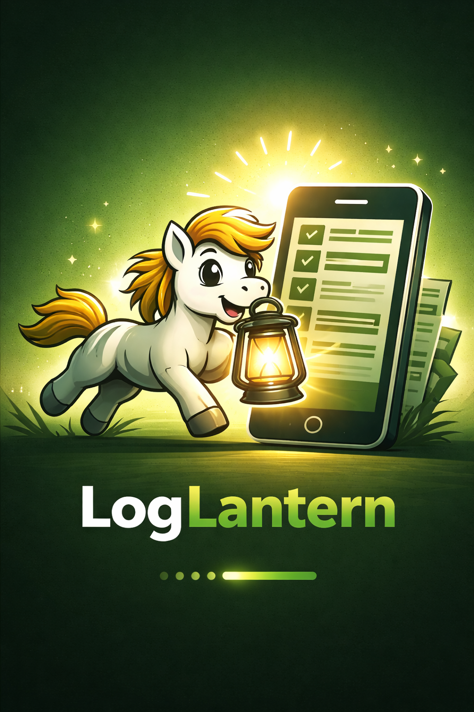

# LogLantern 🔦

LogLantern is an Android application that allows users to securely connect to a Splunk instance
and visualize log data using a mobile-friendly interface.

The application is built as a student project with a focus on modern Android development practices.


## 📸 




## ✨ Key Features

### 🔐 **Secure Authentication**
- Splunk Management REST API integration
- Token-based authentication (no password storage)
- Encrypted local storage for tokens
- Automatic token expiry handling

### 📊 **Data Visualization**
- **Table View** - Interactive data table with search results
- **Pie Chart** - Custom Canvas-based pie chart for statistics
- Real-time SPL (Search Processing Language) queries
- Support for Splunk stats aggregations

### 🎨 **Modern UI/UX**
- 100% Jetpack Compose (no XML layouts)
- Material3 design system
- Bottom navigation bar for easy screen switching
- Responsive layouts
- Custom app icon and splash screen

### 🏗️ **Professional Architecture**
- MVVM (Model-View-ViewModel) pattern
- Repository pattern for data layer
- Hilt for Dependency Injection
- Kotlin Coroutines & Flow for async operations
- State preservation and lifecycle awareness

---

## 🎯 Project Goals

The main goal of this project is to create a mobile client for Splunk that:

- authenticates users via Splunk Management REST API
- securely stores an access/session token
- fetches data from Splunk using REST queries
- visualizes data as a table or a pie chart
- demonstrates MVVM architecture and Jetpack Compose UI

---

## 📱 Application Features

- Splash screen with authentication check
- Login screen for Splunk credentials
- Secure token storage (no password persistence)
- Data fetching via REST API
- Table view of results
- Pie chart visualization
- Settings screen with logout option

---

## 🧭 Application Screens

- Splash Screen
- Login Screen
- Dashboard
- Results Table Screen
- Results Chart Screen
- Settings Screen

---

## 🏗️ Architecture

The application follows the **MVVM (Model–View–ViewModel)** architecture:

- UI layer: Jetpack Compose
- State management: ViewModel + StateFlow
- Data layer: Repository pattern
- Networking: Retrofit + OkHttp

---

## 🧰 Tech Stack

### Core
- **Language:** Kotlin 2.1.21
- **UI Framework:** Jetpack Compose (Material3)
- **Architecture:** MVVM + Repository Pattern
- **Dependency Injection:** Hilt 2.51.1

### Libraries
- **Navigation:** Navigation Compose 2.9.7
- **Networking:** Retrofit 3.0.0 + OkHttp 4.12.0
- **Async:** Kotlin Coroutines + Flow
- **Storage:** DataStore Preferences + Encrypted Storage
- **State Management:** ViewModel + StateFlow + collectAsStateWithLifecycle

### Design
- Material3 Design System
- Material Icons Extended
- Custom Canvas-based Pie Chart
- Bottom Navigation Bar

---

## 🚀 Getting Started

### Prerequisites
- Android Studio Koala or newer
- JDK 17+
- Android SDK 29+
- Gradle 8.13+

### Installation

1. **Clone the repository**
   ```bash
   git clone https://github.com/tomtrenz/LogLantern.git
   cd LogLantern
   ```

2. **Open in Android Studio**
   - Open Android Studio
   - File → Open → Select the project folder
   - Wait for Gradle sync

3. **Configure Splunk connection**
   - Run the app
   - Enter your Splunk base URL (e.g., `https://192.168.1.100:8089`)
   - Enter username and password
   - App will create and store authentication token

4. **Build & Run**
   ```bash
   ./gradlew assembleDebug
   # or use Android Studio Run button
   ```

---

## 📱 Usage

### Login Flow
1. App starts with **Splash Screen**
2. If no token exists → **Login Screen**
3. Enter Splunk credentials (base URL, username, password)
4. Token is created and stored securely
5. Navigate to **Dashboard**

### Navigation
Use the **Bottom Navigation Bar** to switch between screens:
- 🏠 **Dashboard** - Home screen
- 📋 **Table** - Search results in table format
- 📊 **Graph** - Statistics as pie chart
- ⚙️ **Settings** - View stored data and logout

### Search Queries

**Table View:**
```spl
search index=main | head 100 | table _time _raw host source
```

**Pie Chart (Stats):**
```spl
search index=main | stats count by src_ip
search index=main | stats sum(bytes) by user
```

---

## 🔐 Security

### Authentication
- **No password storage** - Passwords are used only for initial authentication
- **Token-based** - JWT tokens stored in encrypted DataStore
- **HTTPS only** - All communication over secure connection
- **Token expiry** - Automatic handling of expired tokens

### Data Storage
- **EncryptedSharedPreferences** for sensitive data
- **DataStore** for user preferences
- **No plaintext credentials** stored on device

---

## 🏗️ Project Structure

```
LogLantern/
├── app/
│   └── src/main/java/cz/splnsito/mrthom/loglantern/
│       ├── app/                    # Application & DI
│       │   ├── LogLanternApplication.kt
│       │   ├── LogLanternApp.kt
│       │   └── di/                 # Hilt modules
│       ├── core/
│       │   ├── network/            # API & interceptors
│       │   ├── security/           # Token storage
│       │   └── ui/                 # Theme & components
│       ├── data/
│       │   ├── local/              # DataStore
│       │   └── repository/         # Repository implementations
│       ├── domain/
│       │   ├── model/              # Domain models
│       │   ├── repository/         # Repository interfaces
│       │   └── usecase/            # Use cases
│       ├── feature/
│       │   ├── splash/             # Splash screen
│       │   ├── auth/               # Login
│       │   ├── dashboard/          # Dashboard
│       │   ├── settings/           # Settings
│       │   └── results/
│       │       ├── table/          # Table view
│       │       └── chart/          # Pie chart
│       └── navigation/             # Navigation graph
├── docs/                           # Documentation
└── README.md
```

---

## 🛠️ Development

### Architecture Principles
- **Single Activity** - MainActivity only
- **Unidirectional Data Flow** - ViewModel → UiState → UI
- **Separation of Concerns** - Clear layer separation
- **Dependency Inversion** - Interface-based dependencies

### State Management
```kotlin
// ViewModel
private val _uiState = MutableStateFlow(UiState())
val uiState = _uiState.asStateFlow()

// Composable
@Composable
fun Screen(viewModel: ViewModel = hiltViewModel()) {
    val uiState by viewModel.uiState.collectAsStateWithLifecycle()
    // Render UI based on state
}
```

### Navigation
- **Navigation Compose** with type-safe routes
- **Bottom Navigation Bar** for main screens
- **State preservation** during navigation

---

## 📦 Build & Deployment

- The application can be built into an APK/AAB
- Runs on emulator or physical device
- Prepared for Google Play deployment

---

## 📄 License

This project is licensed under the MIT License.

---

## 👤 Author

Tomáš Trenz  
Nick: mrthom  
Domain: splnsito.cz  
University: UTB Zlín
